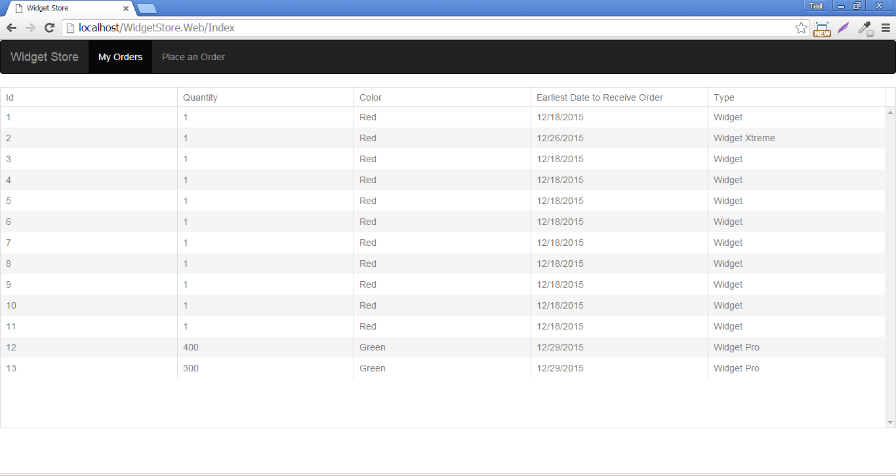
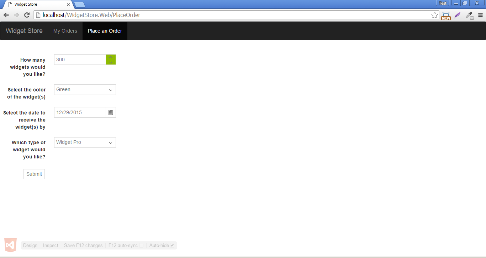
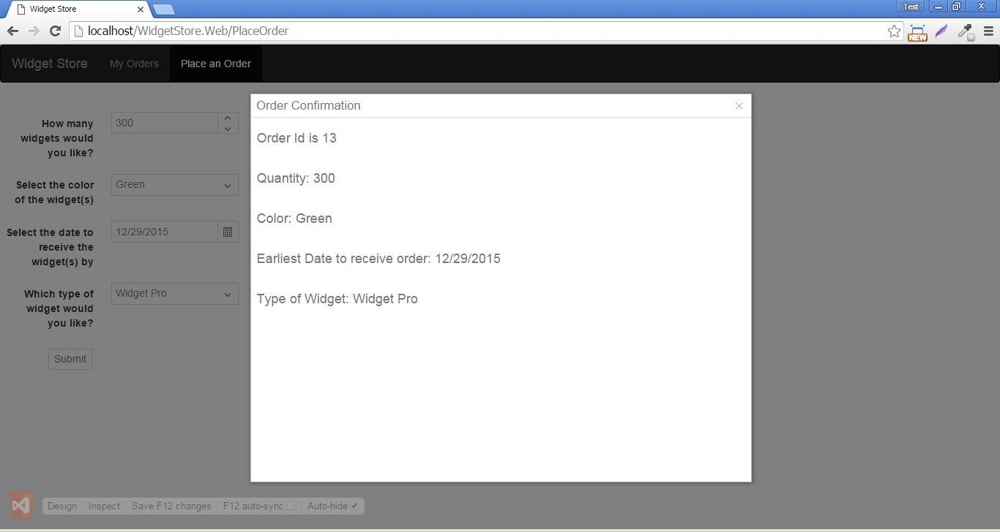

# Widget Store
## Introduction
You are attempting to purchase a Widget. You must choose the number of widgets to purchase, the color of the widgets, when you would like the earliest delivery date (no less than one week from today), and the type of widget.

* Colors
    * Red
    * Blue
    * Green

* Types
    * Widget
    * Widget Pro
    * Widget Xtreme

* Quantity
    * No less than 1 and you may not have partial quantities

* Earliest Date By
    * No less than 1 week from today

## Screenshots

## Assumptions
This application is the prototype of a new order management system. It has one page with a list of orders made and one page where a customer can fill out an order entry form.

## Technologies Used
- Front-End Client
    * ASP.NET Web Form (WidgetStore.Web):
        * KendoUI
        * jQuery
        * Bootstrap

- API (WidgetStore.Api):
    * ASP.NET Web API

- Database Server:
    * Microsoft SQL Server
        * Database name (WidgetStore)

## Architecture
- Front-End Client
    * Kendo Ui controls persist UI controls through databinding
    * jQuery handles the event methods

- API
    * Handles our business logic (value restrictions)
    * Handles our calls to the database through the Entity Framework ORM
    * API calls permit other applications to communicate with the widget store

#### Projects and Files
- WidgetStore.Web
- WidgetStore.Api
- seedDB.sql (create basic SQL database with 3 tables)
